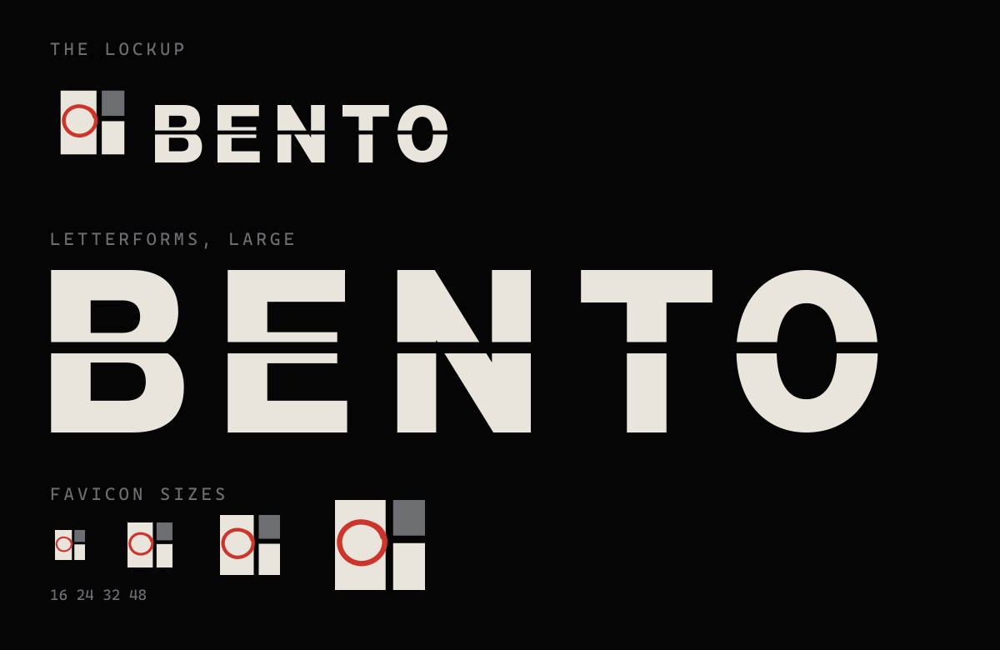

<div align="center">

# Bento

**A contact sheet for everything you save.**

A self hosted bookmark manager in two pieces: a browser extension that captures the tab you are looking at, and a site that lays every capture out as a frame on a contact sheet. SQLite for storage, accounts for the people you share it with.

[](https://github.com/Abudora-0/Bento/actions/workflows/ci.yml)
[](LICENSE)
[](https://nextjs.org)
[](https://www.typescriptlang.org)
[](https://turso.tech)
[](https://www.plasmo.com)
[](#testing)

</div>

---

## What it is

Bento is a bookmark manager built around one idea: a saved page is a photograph you took of the web, so it should be filed like one. Every capture becomes a numbered frame on a contact sheet, complete with sprocket holes, a date stamp, and a hand drawn grease pencil circle on the ones worth keeping.

Sign up, and everything you save is yours. Bookmarks, folders and tags are scoped per account at the database level rather than filtered in application code, so two people using the same deployment never see each other's sheets.

<div align="center">



</div>

The mark and the lettering above are not a mockup. `docs/mark.png` is generated from `website/components/Wordmark.tsx`, so it cannot drift from what the app actually renders.

> **Screenshots of the app itself** are not in the repo yet. Drop them into `docs/` and link them here when you have them, rather than putting a mockup in their place.

## Try it

There is a live deployment at **[bentto.vercel.app](https://bentto.vercel.app)**. Signup asks for an invite code, which is:

```
f1c0485e0e3a
```

The code is here rather than hidden because the point of it is not secrecy. It keeps automated signups and drive-by traffic out of a database and a blob store that both sit on free tiers, while leaving the app open to anyone who actually wanted to look at it. Make an account, add a bookmark by hand, and the sheet is yours.

If you would rather run your own, the whole thing is below and takes about five minutes.

## Installing the extension

Grab the latest zip from [Releases](https://github.com/Abudora-0/Bento/releases/latest), then:

1. Unzip it.
2. Open `chrome://extensions`, or `edge://extensions`.
3. Switch on **Developer mode**, choose **Load unpacked**, and pick the unzipped folder.
4. Open the popup and paste in your site's address and your extension token, which is on the site under **Settings**.

Your browser will warn about developer mode every time it starts. That is the cost of installing from outside a store, not a sign anything is wrong.

There is no `.crx` download on purpose. Chrome refuses to install a packaged extension from anywhere but its own web store, so a `.crx` here would only look like it worked, then fail silently. Loading the unpacked folder is the sideload that actually works.

The build is plain Chromium MV3, so it loads in Chrome, Edge, Brave, Arc, Vivaldi and Opera unchanged. Firefox needs a different target and is not built yet.

## Features

**Capturing**

- **One click capture** from the toolbar: title, URL, favicon, and a screenshot of the visible page
- **Quick capture** on `Ctrl+Shift+S`, no popup, badge flashes to confirm
- **Add by hand** for pages the extension cannot reach, with a server side favicon lookup
- **Merge on re-capture**, so saving the same page twice unions its tags instead of duplicating it

**The sheet**

- **Bento grid layout**, frames in nine varying sizes rather than a uniform card wall
- **A loupe**, because that is what you do with a contact sheet: space blows a frame up, arrows walk the roll
- **Command palette** on `Ctrl+K`, or `Cmd+K`, to jump to a folder, a tag, or an action
- **Marking up from the keyboard**, arrows to move, `x` to select, `s` to star, Enter to open
- **Bulk actions**, select several frames and mark, file or delete them together
- **Search** across titles, addresses and notes, with `/` to focus from anywhere
- **Tags, folders and starring**, all filterable, all shareable as a URL
- **A tab title that says what you are looking at**, so several open sheets are tellable apart

**Accounts**

- **Separate sheets**, so a handful of people can share one deployment without seeing each other's
- **Sign in with either** your username or your email, and reveal the password if you need to check it
- **A real lock**, not a password prompt: closes when the browser closes, after inactivity, or on demand
- **Rate limited**, so the lock cannot be worked through with a word list

## Design

Two surfaces, one design language: a darkroom contact print.

|  | |
| --- | --- |
| **Ground** | `#050506` gutter, `#0d0d0e` frames |
| **Print** | `#e9e5dc` cream, `#a9aaae` silver |
| **Accent** | `#cc352c` grease pencil red |
| **Trim** | `#c9a24a` gold, focus rings only |
| **Type** | Oswald for structure, IBM Plex Mono for everything else |

Every border is a one pixel inset hairline, never a drop shadow. Nothing has a border radius. Depth is expressed only by stepping a fixed alpha ladder, so a hover and a focus differ by a rung rather than by a new colour. Screenshots are desaturated so they read as prints, and brighten when you hover a frame, like holding a negative up to the light.

**Nothing on the page is a browser default.** Checkboxes, dropdowns and scrollbars are all drawn from scratch, because each of them ships with rounded corners and its own highlight colour, and one native control is enough to make a design look like a template someone forgot to finish. The dropdown in particular is a real listbox rather than a styled `<select>`: setting `appearance: none` fixes the closed state and nothing else, since the popup list belongs to the operating system.

The mark is the same idea in one square, three compartments with the largest circled in grease pencil, which is the identical gesture to starring a bookmark. The name beside it is drawn as outlines rather than set in a typeface, so the logo carries no font dependency and the extension embeds the same paths without a font file going into its bundle.

Motion follows the same metaphor. Frames develop in rather than fading, the wordmark comes up a letter at a time while its circle pencils itself, the grease pencil draws when you star something, the sheet advances like film between pages, and the lock screen is a bento lid that parts down the middle. All of it is plain CSS with no animation library, and all of it respects `prefers-reduced-motion`.

## Stack

| Piece | Built with |
| --- | --- |
| Website | Next.js 15 App Router, React 19, TypeScript, Tailwind CSS v4 |
| Data | SQLite, through Turso and libSQL |
| Extension | Plasmo, React, TypeScript, Manifest V3, Chrome and other Chromium browsers |

The site's own pages query the database directly from server actions, with nothing in between. The extension cannot do that, so it calls a handful of API routes instead. Those routes are the only part of this project that looks like a conventional backend.

Every query is a network round trip now, so the tray page sends its four reads as a single batch. Locally that measured 404ms sequential against 149ms batched, and colocating the app with the database makes both far smaller.

## Security model

Two surfaces, two completely separate ways in. That separation is deliberate: the lock can change without the extension noticing, and a leaked extension token cannot be used to sign in.

**Passwords** are PBKDF2-HMAC-SHA256 at 210,000 iterations with a per user salt, stored as a self describing string so the cost can be raised later without locking out anyone who signed up before the change. PBKDF2 rather than argon2 because middleware runs on the Edge runtime, where Web Crypto is the only thing available and PBKDF2 is the only password function it offers. Verification compares over the full length without short circuiting. Signing in with an account nobody registered still runs a hash before answering, so the response time does not say which half of the guess was wrong. Minimum ten characters, and a password that is simply your username or your email address is refused.

**Guessing is rate limited**, counted in the database rather than in memory, because a serverless instance shares nothing with the next one and a module level counter would silently reset. Two limits apply at once: eight failures against one account in fifteen minutes, and twenty five from one address over the same window. The first stops a password list, the second stops one address spraying a single guess across many accounts. The check runs *before* the password is verified, so a refused attempt costs one indexed read rather than 200ms of PBKDF2, measured at 1ms against 140ms. Signing in successfully forgets that account's failures, and never the address's. New accounts are capped at five per address per hour.

Sign in accepts an email or a username in the same field, and the limiter counts the **account** rather than the string that was typed. Counting the string would hand anyone who knows both of your names two separate allowances.

**The site** mints an HMAC signed session cookie on a correct sign in, verified in middleware on every request. It is `HttpOnly`, `SameSite=Lax`, `Secure` over HTTPS, and by default carries no expiry, which makes it a session cookie: closing the browser drops it. The signed timestamp inside enforces the idle window, and every navigation slides that window forward. Ticking **Stay signed in** gives the cookie a lifetime, and the idle window still applies on top of it.

It locks again in three ways:

1. Closing the browser, unless you asked to stay signed in
2. Sitting idle for `BENTO_LOCK_MINUTES`, enforced by the server as well as the tab
3. Pressing **Lock**

**The extension** cannot answer a lock screen, so it sends a per account token as a bearer token, checked on each API route. That token is not your password. It is generated for you at signup, and regenerating it under Settings cuts off every browser holding the old one without touching the account.

**Isolation** is enforced in SQL, not in a filter somewhere. Every read and every write carries `user_id`, and the unique index on bookmarks is `(user_id, url)` rather than `url`, so two people can both save the same page. There is a test suite whose entire job is trying to reach another account's rows through each entry point.

> **What this does not do.** It protects the interfaces, not the bytes. Anyone holding `TURSO_AUTH_TOKEN` can read the whole database directly, past every account boundary in it. This is a self hosted app for a small number of people who already trust whoever runs it, and it is not multi tenant in the sense a commercial product would mean.

Signup is open by default, which is what a portfolio piece wants. Setting `BENTO_INVITE_CODE` makes the form ask for that code, which closes a public deployment without taking signup down.

## Setup

Node 20 or newer, and a free Turso account.

### 1. The database

Create a database at [turso.tech](https://turso.tech) and generate a read and write token for it. Pick a region close to wherever the app will run rather than close to you: your browser hits the site once per page, the site hits the database several times.

### 2. The site

```bash
cd website
npm install
cp .env.example .env.local
```

Fill in `.env.local`:

| Variable | What it is |
| --- | --- |
| `BENTO_SECRET` | The key session cookies are signed with. Not a password, nobody ever types it. `openssl rand -hex 32` |
| `BENTO_LOCK_MINUTES` | Idle minutes before it locks itself. Defaults to 30 |
| `BENTO_INVITE_CODE` | Optional. Set it and the signup form asks for it, compared in constant time. Leave it unset and signup is open |
| `TURSO_DATABASE_URL` | From step 1 |
| `TURSO_AUTH_TOKEN` | From step 1 |

Changing `BENTO_SECRET` later signs everybody out, since it is the key their cookies were signed with. That is intended, not a bug.

Create the tables, which is safe to run again at any time:

```bash
npm run db:push
```

Then:

```bash
npm run dev
```

It runs at http://localhost:3000. The first thing it shows is the lock screen, which has a **Create an account** button. Pick a username, and you land on your sheet.

### 3. The extension

```bash
cd extension
npm install
npm run dev
```

Load it at `chrome://extensions`, switch on Developer mode, choose **Load unpacked**, and pick `extension/build/chrome-mv3-dev`. For a production bundle run `npm run build` and pick `extension/build/chrome-mv3-prod`, or `npm run package` to get the same zip that goes on a release.

If you only want to *use* Bento rather than work on it, take the zip from [Releases](https://github.com/Abudora-0/Bento/releases/latest) instead. See [Installing the extension](#installing-the-extension).

Open the popup. It asks for the site's address and your extension token, which is on the site under **Settings**. Copy it, paste it in, and the popup checks both fields against the real API before it saves them.

## Using it

- **Capture**: click the Bento icon, pick a folder, add tags and a note, press Capture
- **Quick capture**: `Ctrl+Shift+S`, or `Cmd+Shift+S` on macOS. Files into whichever folder the popup is set to
- **Add by hand**: the Add button on the site, for pages the extension cannot reach. It looks up a favicon server side. No screenshot for a typed address, that would need rendering the page
- **Star**: the grease pencil circle, in either surface
- **Look closely**: press space, or click a frame number, to put a loupe over the capture
- **Filter**: click a tag, pick a folder, or narrow to marked only
- **Mark up a batch**: shift click frames, or press `x` on each, then use the bar that appears
- **Lock**: the Lock button in the header, or `Ctrl+K` then Lock
- **Pair another browser**: Settings has your extension token, and a Regenerate button for cutting an old one off

Chrome will not let any extension screenshot its own pages, the web store, or local files. On those the popup says so rather than failing quietly.

### Keyboard

The sheet is meant to be marked up without reaching for the mouse.

| Key | What it does |
| --- | --- |
| `/` | Focus the search field |
| `Ctrl+K` | Command palette: folders, tags, and actions. `Cmd+K` on macOS |
| `Arrows` | Move the cursor across the sheet |
| `Home` / `End` | First and last frame on the page |
| `Space` | Loupe on the frame under the cursor, arrows then walk the roll |
| `Enter` | Open the page in a new tab |
| `s` | Star, or unstar |
| `x` | Add the frame to the selection |
| `Escape` | Clear the selection, close the loupe or the palette |

Shortcuts stand down while you are typing in a field, and while the loupe or the palette is open.

## Testing

```bash
cd website
npm test
```

202 tests, using `node:test` with Node's type stripping, so there is no test framework and no extra dependency. They cover password hashing and verification, account creation and sign in, username rules, the rate limiter, the session token and the lock middleware, URL normalisation, the SSRF guard, paging maths, query building, the mirrored type check, the merge and screenshot replacement rules, and every API route end to end. One suite exists purely to attempt cross account access through every entry point and confirm each one refuses.

The database tests run against real in-memory libSQL rather than a mock, because what is worth checking is what only the engine knows: that `json_each` finds a tag, that the unique index on url makes a recapture merge, that deleting a folder unfiles its bookmarks. A mock would agree with whatever the code believed.

What is **not** covered: the React components, the sign in and sign up server actions, and the extension. The interface was walked by hand instead. The database layer underneath the bulk actions does have cross account tests, because that is where getting it wrong would actually matter.

## Scripts

**Website**

```bash
npm run dev         # development server
npm run build       # production build
npm run start       # run the production build
npm run db:push     # apply the schema to whichever database is configured
npm run db:reset    # drop every table and start over, refuses if there are rows
npm test            # node:test
npm run typecheck   # tsc --noEmit
npm run lint
```

**Extension**

```bash
npm run dev         # development build with hot reload
npm run build       # production build
npm run package     # zip for the Chrome Web Store
npm run icon        # regenerate assets/icon.png
npm run typecheck
```

The toolbar icon is generated rather than committed as an opaque binary. `scripts/make-icon.mjs` draws it with plain arithmetic and writes the PNG itself, zlib deflate and CRC32 by hand, so a change to the mark is a readable diff.

**Migrations are written by hand when they have to be.** `db:push` is `CREATE IF NOT EXISTS`, which means it can add a table and can never alter one, so adding a column to a database that already has rows needs either `db:reset`, which throws the rows away, or a script. `website/scripts/migrate-add-username.mjs` is the worked example: it adds the column nullable, because SQLite cannot add a `NOT NULL` column to a populated table without a default and a shared default would collide with the unique index, then backfills it, then creates the index. It is safe to run twice.

## Deploying

It runs on Vercel's free tier. Nothing is written to disk, so there is no volume to attach and nothing to keep alive.

1. Import the repository on Vercel and set **Root Directory** to `website`. It is a monorepo, and skipping this is the one mistake that fails confusingly.
2. Under Storage, create a **Blob** store and connect it to the project. Vercel injects `BLOB_READ_WRITE_TOKEN` for you.
3. Set `BENTO_SECRET`, `TURSO_DATABASE_URL` and `TURSO_AUTH_TOKEN` as environment variables. Add `BENTO_INVITE_CODE` if you would rather signup were not open to whoever finds the url.
4. Under Settings, Functions, set the region to match wherever your Turso database lives. This is worth doing: the app queries the database far more often than your browser queries the app, so the hop that matters is the one between them.
5. Run `npm run db:push` once against the production database, if you have not already.
6. Sign up on the deployed site, open Settings, and point the extension popup at the url with the token it shows you.

Fonts are self hosted from Fontsource rather than fetched by `next/font/google`, so the build makes no network calls for them.

### Somewhere other than Vercel

Nothing here is Vercel specific except Blob. Any host that runs Next will do, and swapping `lib/blob.ts` for Cloudflare R2 or S3 is a small, self contained change: it is two functions, one that stores a file and one that deletes it.

## Privacy

Bento has no servers of its own. Every deployment belongs to whoever set it up, and the extension only ever talks to the address you type into it.

**The extension** stores two things in `chrome.storage.local`: the site address you paired it with, and your extension token. Neither leaves your browser except in requests to that address. It reads the current tab's title, url, favicon and a screenshot **only when you press Capture or the keyboard shortcut**, never in the background, and sends them to your Bento and nowhere else. Its permissions are `activeTab`, `tabs` and `storage`, and it requests no host permissions at all.

**The site** stores your email, a username, a PBKDF2 hash of your password, and your bookmarks. Screenshots go to whichever blob store the deployment is configured with. Nothing is sent to any third party, there is no analytics, and there are no cookies beyond the one signed session cookie the lock needs.

**Favicons are fetched by the server**, not your browser, when you add a bookmark by hand. That request goes to the site you bookmarked. It is guarded against pointing at private network addresses, see `lib/ssrf-guard.ts`.

If you use someone else's deployment, all of the above is true of them rather than of this project, and they can read the database. Run your own if that matters to you.

## Licence

MIT. See [LICENSE](LICENSE).
